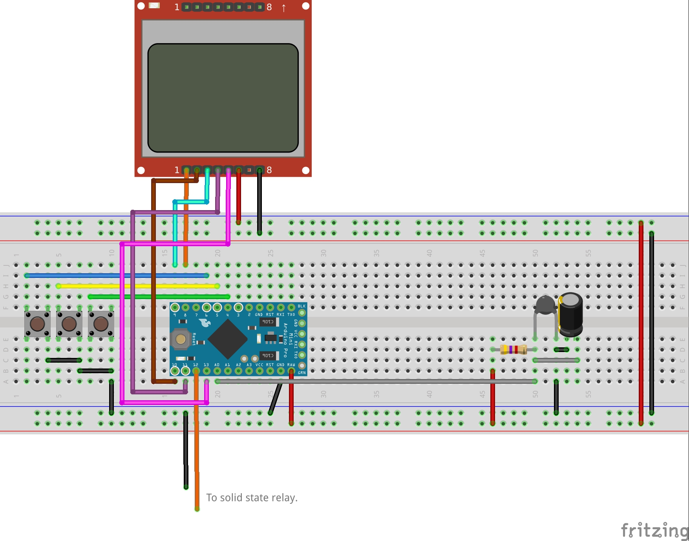

# Hotplate reflow controller

This is still a work in progress, and controller code has issues of overshooting the target temperature **use at your own risk.** 

This is a implementation of temperature control of heated plate for reflow soldering.

## Wiring

To make this you will need:
1. Arduino pro mini (or any other microcontroller)
2. Thermal resistor (I used 100k one from my 3d printer spares)
3. 4.7kOhm resistor for temperature resistor pullup
4. 10uF capacitor for stabilizing sensor value
5. Nokia 5510 display module (Or other display module... code might need to be patched for this though)
6. Solid state relay (use solid state relay to avoid arking when Arduino enables disables the output pin)
7. if Arduino runs on 5V you will need additional 5 10k resistors and one 1kOhm resistors on the SPI line ment for display.

## Compiling code

To compile Arduino code you will need few additional libraries.
1. Thermistor library [from here](https://github.com/miguel5612/ThermistorLibrary) or Arduino IDE library section
2. Adafruit PCD8544 library from Arduino IDE library section [or here](https://github.com/adafruit/Adafruit-PCD8544-Nokia-5110-LCD-library). Dont forget to install dependencies for it too.

## Known issues
- Thermal runaway algorithm is ignoring the state of solid state relay output pin
- Controller code does not account for thermal mass of the heater and plate. This will get solved once PID algorithm is added.